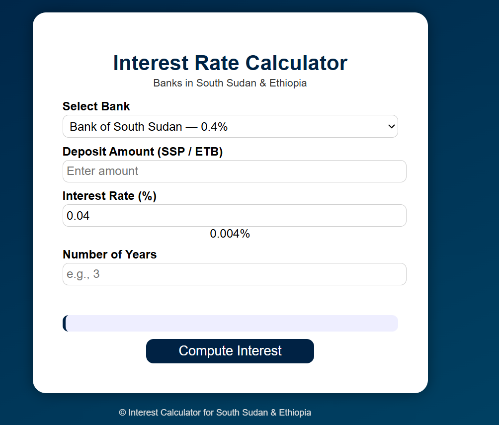

# 💰 Simple Interest Calculator

A **web-based interest calculator** designed for users in **South Sudan** and **Ethiopia**, helping them estimate their total savings over time based on bank interest rates. This tool is user-friendly, responsive, and works on all devices.

---

## ✨ What's New

The app has been redesigned with a **ledger/passbook visual identity** — warm paper tones, a deep teal brand color, and a sunbaked ochre accent — to feel like a proper savings tool rather than a generic form.

- **New look and feel** — custom typography (Spectral for headings, IBM Plex Sans for UI text, IBM Plex Mono for all numeric values), a two-panel layout (bank & currency / deposit details), and a result card styled as a torn-off bank passbook stub.
- **Dark mode that remembers your choice** — the toggle now saves your preference and respects your system's light/dark setting on first visit.
- **Bank preview card** — shows the selected bank's logo, name, and rate together, with a graceful fallback if a logo image is missing.
- **Paired rate slider + number field**, kept in sync in both directions, so you can drag or type.
- **Inline validation** — invalid input now shows a message next to the form instead of a browser `alert()` popup.
- **Fully responsive** using fluid, `clamp()`-based sizing, so text and spacing scale smoothly across mobile, tablet, and desktop instead of jumping at fixed breakpoints.
- **Accessible by default** — visible keyboard focus states, ARIA live regions for the result, and `prefers-reduced-motion` support.
- **Two bugs fixed:**
  - Bank interest rates were previously stored 100× too small (e.g. selecting a bank labeled "7%" silently set the rate to 0.07%). Rates now match their labels exactly.
  - The **Download PDF** button referenced a PDF library that was never loaded, so it didn't work. jsPDF is now included and the button is functional, producing a cleanly formatted result summary.

---

## 🌍 Features

- Calculate **simple interest** for a given deposit, interest rate, and time period.
- **Preloaded bank interest rates** for popular banks in South Sudan and Ethiopia.
- **Customizable interest rates** with a synced slider and number field.
- **Currency toggle** between SSP and ETB.
- **Light and dark themes**, saved across visits.
- **Downloadable PDF** of your result.
- Responsive design — works on **mobile, tablet, and desktop**.
- Clean, professional, passbook-inspired UI.
- Interactive and easy to use, with inline error messages instead of popups.

---

## 🏦 Supported Banks & Rates

### South Sudan
- Bank of South Sudan — **0.4%**
- Equity Bank South Sudan — **7%**
- KCB South Sudan — **10%**

### Ethiopia
- Commercial Bank of Ethiopia — **8%**
- Dashen Bank — **13%**
- Awash Bank — **15%**

> Users can also adjust the interest rate manually using the slider or number field.

---

## 📷 Screenshot



> Screenshot pending an update to reflect the new design — swap in a fresh capture when available.

---

## 🛠 Technologies Used

- **HTML5** – structure of the web app
- **CSS3** – responsive, ledger-inspired styling with light/dark themes
- **JavaScript** – calculation logic, form validation, theme persistence, and PDF export
- **[jsPDF](https://github.com/parallax/jsPDF)** (via CDN) – generates the downloadable PDF result
- **Google Fonts** – Spectral, IBM Plex Sans, IBM Plex Mono

---

## 📚 How It Works

1. Choose your **currency** (SSP or ETB).
2. Select a **bank** to automatically set the interest rate — its logo, name, and rate appear in the preview card.
3. Enter the **deposit amount**.
4. Adjust the **interest rate** if needed, using the slider or number field.
5. Enter the **number of years** for your savings.
6. Click **Compute interest**.
7. The passbook-style result shows:
   - Deposit amount
   - Interest rate
   - Term (years)
   - Maturity year
   - Total at maturity
8. Click **Download PDF** to save a copy of the result.

---

## 🌐 Live Demo

You can try the live calculator here: [View Live App](https://gatbel-22.github.io/simple_interest_calculator/)

---

## 🚀 Future Improvements

- Add **compound interest** calculation.
- Display **graphs/charts** showing growth over time.
- Compare multiple banks side-by-side.
- Support additional currencies (e.g. USD).
- Fetch **real-time bank rates** via API.
- Convert into a **Progressive Web App (PWA)**.

---

## 🔧 Installation

Clone the repository:

```bash
git clone https://github.com/YOUR-USERNAME/simple_interest_calculator.git
cd simple_interest_calculator
```

No build step or package manager is required — just open `index.html` in a browser. Fonts and the PDF library load from a CDN, so an internet connection is needed the first time the page loads.
